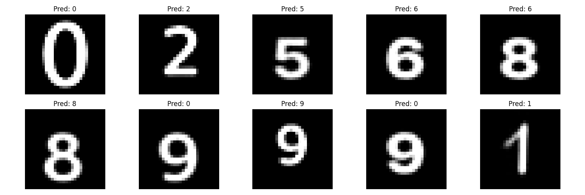
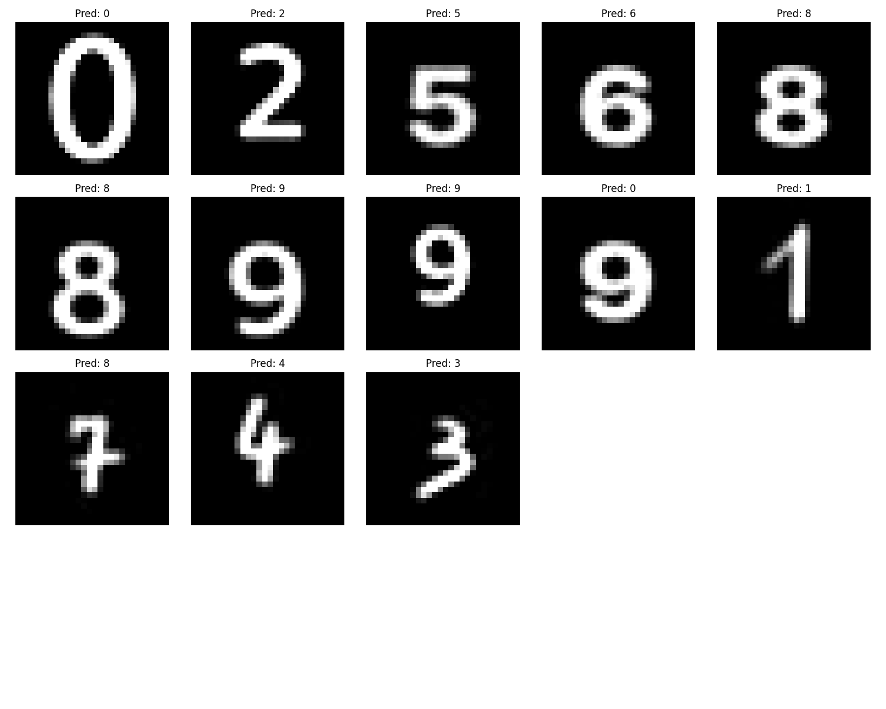

# Neural Networks completely from scratch!

This project shows implementations for __Feed-Forward__ and __Convolutional__ networks, both trained on the full __MNIST__ dataset. <br />
A k-fold cross validation process has been applied as well as __Dataset Shift__: given the best models, they are capable of classifying images never seen before! <br >
That is because they are not online or everywhere else, but created by me (dimensions, fonts and positions change of course). <br />
Training and Validation errors are shown for each epoch, for each fold.

Details:
- Learning algorithm used: __mini-batch__.
- Update Parameters rule (optimizer): classic version of __Adaptive Moment Estimation__.
- __Cross-Entropy + Softmax__ to evaluate errors, how well the training is going.
- __ReLU__ and __Sigmoid__ as activation function choices.

I'll also show some of the images predicted by the best models, images related to the dataset shift. <br />
A small quantity of them is located in the __batch__ folder.

### Running Code
Execution, for now, is only about the convolutional network. <br />
The Feed-Forward model is about to receive an update: a much better version of the process of predicting custom images. <br />
__So... update coming soon!__

## Best Feed-Forward Model Accuracy

The hyperparameters search has produced this architecture, with an average test accuracy of __97.92%__. <br />
The folder __neura_nova/results/ff/__ shows graphs errors for each schema created (you find them in the __config__ folder). <br />

```json
    {
        "batch_size": 64,
        "epochs": 15,
        "validation_dimension": 20000,
        "train_dimension": 60000,
        "test_dimension": 10000,
        "learning_rate": 0.001,
        "beta1": 0.9,
        "beta2": 0.999,
        "epsilon": 1e-08,
        "layers": [
            {
                "neurons": 256,
                "activation": "relu"
            },
            {
                "neurons": 10,
                "activation": "identity"
            }
        ]
    }
```

```json
{
    "fold_results": [
        {
            "fold_number": 1,
            "validation_size": 20000,
            "val_accuracy": 0.9772,
            "test_accuracy": 0.9786
        },
        {
            "fold_number": 2,
            "validation_size": 20000,
            "val_accuracy": 0.979,
            "test_accuracy": 0.9806
        },
        {
            "fold_number": 3,
            "validation_size": 20000,
            "val_accuracy": 0.97605,
            "test_accuracy": 0.9785
        }
    ],
    "avg_val_accuracy": "97.74",
    "avg_test_accuracy": "97.92",
    "std_test_accuracy": "0.10"
    }
```



## Best Convolutional Model Accuracy

The hyperparameters search has produced this architecture, with an average test accuracy of __98.48%__. <br />
The folder __neura_nova/results/cnn/__ shows graphs errors for each schema created (you find them in the __config__ folder). <br />

```json
    {
    "batch_size": 128,
    "epochs": 15,
    "validation_dimension": 30000,
    "train_dimension": 60000,
    "test_dimension": 10000,
    "learning_rate": 0.001,
    "beta1": 0.9,
    "beta2": 0.999,
    "epsilon": 1e-08,
    "conv_layers": [
      {
        "filters": 8,
        "kernel_size": 3,
        "stride": 1,
        "activation": "relu"
      },
      {
        "filters": 16,
        "kernel_size": 3,
        "stride": 1,
        "activation": "relu"
      }
    ],
    "max_pool_layers": [
      {
        "kernel_size": 2,
        "stride": 2
      },
      {
        "kernel_size": 2,
        "stride": 2
      }
    ],
    "fc_layers": [
      {
        "neurons": 64,
        "activation": "relu"
      },
      {
        "neurons": 10,
        "activation": "identity"
      }
    ]
    }
```

```json
    {
    "fold_results": [
        {
            "fold_number": 1,
            "validation_size": 30000,
            "val_accuracy": 0.9820333333333333,
            "test_accuracy": 0.9853
        },
        {
            "fold_number": 2,
            "validation_size": 30000,
            "val_accuracy": 0.9822333333333333,
            "test_accuracy": 0.9844
        }
    ],
    "avg_val_accuracy": "98.21",
    "avg_test_accuracy": "98.48",
    "std_test_accuracy": "0.04"
    }
```




## LICENSE

[GNU GPLv3](https://choosealicense.com/licenses/gpl-3.0/)

Copyright © 2024-2025 "SimDeveloper-cripto" <https://simdeveloper-cripto.github.io/>.